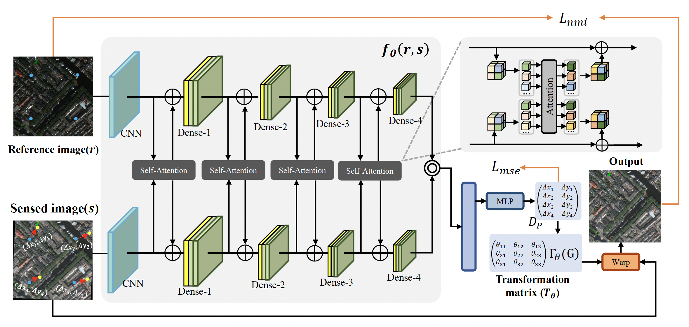

# Multimodal image fusion framework for end-to-endremote sensing image registration




## Contents

1. Dataset and Data generation
2. Training


## Dataset and Data generation

For training, validating, and testing the proposed network,we employ the PS-RGB(RGB), Multispectral(MS), andSAR-Intensity(SAR) datasets from the SpaceNet [32] dataset.

In addition to the dataset itself, we have provided the scripts for data generation. To generate data,using the py file in the XXX folder

```Shell

```

## Training
Our dataset is generated via a privileged agent which we call the autopilot (`/team_code_autopilot/autopilot.py`) in 8 CARLA towns using the routes and scenario files provided in [this folder](./leaderboard/data/training/). See the [tools/dataset](./tools/dataset) folder for detailed documentation regarding the training routes and scenarios. You can download the dataset (210GB) by running:

```Shell
chmod +x download_data.sh
./download_data.sh
```

The dataset is structured as follows:
```
- Scenario
    - Town
        - Route
            - rgb: camera images
            - depth: corresponding depth images
            - semantics: corresponding segmentation images
            - lidar: 3d point cloud in .npy format
            - topdown: topdown segmentation maps
            - label_raw: 3d bounding boxes for vehicles
            - measurements: contains ego-agent's position, velocity and other metadata
```

### Data generation
In addition to the dataset itself, we have provided the scripts for data generation with our autopilot agent. To generate data, the first step is to launch a CARLA server:

```Shell
./CarlaUE4.sh --world-port=2000 -opengl
```

For more information on running CARLA servers (e.g. on a machine without a display), see the [official documentation.](https://carla.readthedocs.io/en/stable/carla_headless/) Once the server is running, use the script below for generating training data:
```Shell
./leaderboard/scripts/datagen.sh <carla root> <working directory of this repo (*/transfuser/)>
```

The main variables to set for this script are `SCENARIOS` and `ROUTES`. 

### Training script

The code for training via imitation learning is provided in [train.py.](./team_code_transfuser/train.py) \
A minimal example of running the training script on a single machine:
```Shell
cd team_code_transfuser
python train.py --batch_size 10 --logdir /path/to/logdir --root_dir /path/to/dataset_root/ --parallel_training 0
```
The training script has many more useful features documented at the start of the main function. 
One of them is parallel training. 
The script has to be started differently when training on a multi-gpu node:
```Shell
cd team_code_transfuser
CUDA_VISIBLE_DEVICES=0,1 OMP_NUM_THREADS=16 OPENBLAS_NUM_THREADS=1 torchrun --nnodes=1 --nproc_per_node=2 --max_restarts=0 --rdzv_id=1234576890 --rdzv_backend=c10d train.py --logdir /path/to/logdir --root_dir /path/to/dataset_root/ --parallel_training 1
```
Enumerate the GPUs you want to train on with CUDA_VISIBLE_DEVICES.
Set the variable OMP_NUM_THREADS to the number of cpus available on your system.
Set OPENBLAS_NUM_THREADS=1 if you want to avoid threads spawning other threads.
Set --nproc_per_node to the number of available GPUs on your node.


## Evaluation

### Longest6 benchmark
We make some minor modifications to the CARLA leaderboard code for the Longest6 benchmark, which are documented [here](./leaderboard). See the [leaderboard/data/longest6](./leaderboard/data/longest6/) folder for a description of Longest6 and how to evaluate on it.

### Pretrained agents
Pre-trained agent files for all 4 methods can be downloaded from [AWS](https://s3.eu-central-1.amazonaws.com/avg-projects/transfuser/models_2022.zip):

```Shell
mkdir model_ckpt
wget https://s3.eu-central-1.amazonaws.com/avg-projects/transfuser/models_2022.zip -P model_ckpt
unzip model_ckpt/models_2022.zip -d model_ckpt/
rm model_ckpt/models_2022.zip
```

